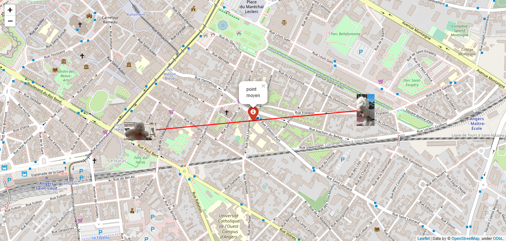

# Mini-projet : Méta-données EXIF

Le but de ce mini-projet est de lire les métadonénes EXIF de photos pour pouvoir les placer sur une carte aux bonnes coordonées géographiques, avec la bonne orientation (paysage ou portrait).

