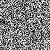

**Un carré façon Morellet**

Le but de ce TP est de reproduire l'oeuvre de François Morellet *Répartition aléatoire de 40 000 carrés selon les chiffres pairs et impairs d’un annuaire de téléphone* mais en utilisant les décimales de $\pi$ plutôt qu'un annuaire.

On peut admirer l'oeuvre d'origine en cliquant sur ce [lien](http://radicalart.info/AlgorithmicArt/grid/any/index.html)

Pour la liste des décimales de $\pi$, on pourra prendre la liste des [10 000 premières décimales](http://www.plouffe.fr/simon/constants/pi10000.txt) proposées par Simon Plouffe.

