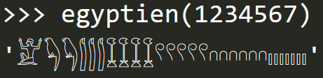

#Numération égyptienne

Le but de ce mini-projet est d'écrire une fonction `egyptien(nb)` qui effectue la conversion d'un nombre entier `nb` dans le système de numération de l’Égypte
antique.

Voici le résultat attendu :

